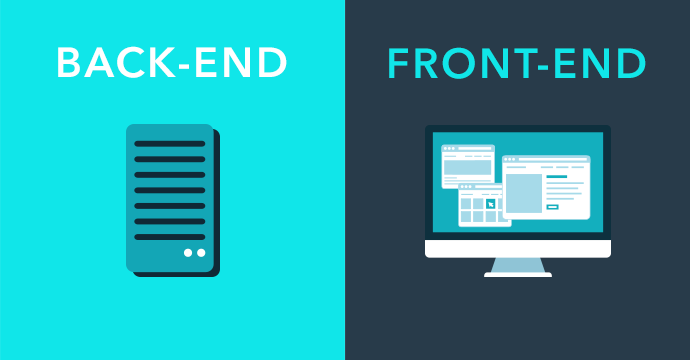
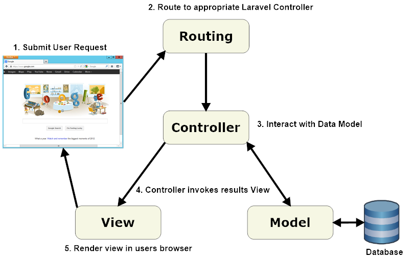
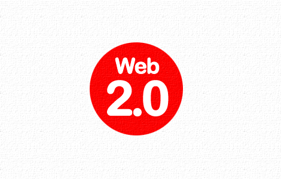
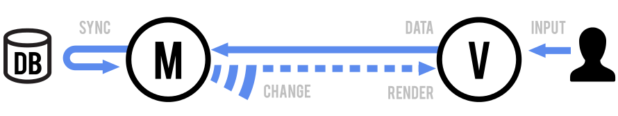
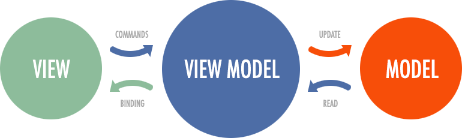
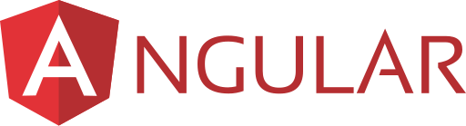
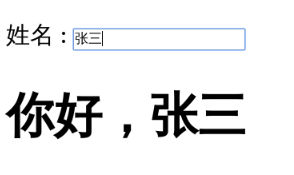
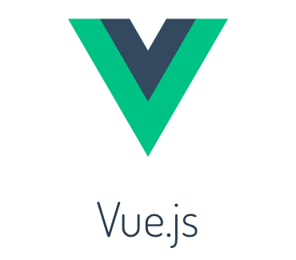
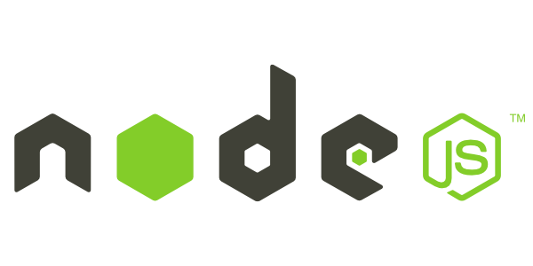

# 前端开发的历史和趋势

---

## 什么是前端

- 前端：针对浏览器的开发，代码在浏览器运行
- 后端：针对服务器的开发，代码在服务器运行



---

## 前后端不分的时代

互联网发展的早期，前后端开发是一体的，前端代码是后端代码的一部分。

1. 后端收到浏览器的请求
1. 生成静态页面
1. 发送到浏览器

---

## 后端 MVC 的开发模式

那时的网站开发，采用的是后端 MVC 模式。

- Model（模型层）：提供/保存数据
- Controller（控制层）：数据处理，实现业务逻辑
- View（视图层）：展示数据，提供用户界面

前端只是后端 MVC 的 V。

---

以 PHP 框架 Laravel 为例。



---

## 前端工程师的角色

那时的前端工程师，实际上是模板工程师，负责编写页面模板。

后端代码读取模板，替换变量，渲染出页面。

---

## 典型的 PHP 模板

```php
<html>
  <head><title>Car {{ $car->id }}</title></head>
  <body>
    <h1>Car {{ $car->id }}</h1>
    <ul>
      <li>Make: {{ $car->make }}</li>
      <li>Model: {{ $car->model }}</li>
      <li>Produced on: {{ $car->produced_on }}</li>
    </ul>
  </body>
</html>
```

---

## Ajax

Ajax 技术诞生，改变了一切。

- 2004年：Gmail
- 2005年：Google 地图

前端不再是后端的模板，可以独立得到各种数据。

---

## Web 2.0

Ajax 技术促成了 Web 2.0 的诞生。



- Web 1.0：静态网页，纯内容展示
- Web 2.0：动态网页，富交互，前端数据处理

从那时起，前端变得复杂了，对前端工程师的要求越来越高。

---

## 前端 MVC 框架

前端通过 Ajax 得到数据，因此也有了处理数据的需求。

前端代码变得也需要保存数据、处理数据、生成视图，这导致了前端 MVC 框架的诞生。

- 2010年，Backbone.js


---

## Backbone.js

Backbone 将前端代码分成两个基本部分。

- Model：管理数据
- View：数据的展现



---

## 前端 Controller

Backbone 只有 M 和 V，没有 C。因为，前端 Controller 与后端不同。

- 不需要，也不应该处理业务逻辑
- 只需要处理 UI 逻辑，响应用户的一举一动

所以，前端 Controller 相对比较简单。Backbone 没有 C，只用事件来处理 UI 逻辑。

```javascript
  var AppView = Backbone.View.extend({
    // ...
    events: {
      "keypress #new-todo":  "createOnEnter",
      "click #clear-completed": "clearCompleted",
      "click #toggle-all": "toggleAllComplete"
    },
  });
```

---

## Router

前端还有一种天然的方法，可以切换视图，那就是 URL。

通过 URL 切换视图，这就是 Router（路由）的作用。以 Backbone 为例。


---

```javascript
App.Router = Backbone.Router.extend({
  routes: {
    '': 'index',
    'show': 'show'
    },
  index: function () {
    $(document.body).append("调用了 Index 路由");
  },
  show: function () {
    $(document.body).append("调用了 Show 路由");
  },
});
```
---

## 示例：Backbone Router

打开`demos/backbone-demo/index.html`，按照[《操作说明》](../demos/README.md#backbone)，查看示例。


---

## MVVM 模式

另一些框架提出 MVVM 模式，用 View Model 代替 Controller。

- Model
- View
- View-Model：简化的 Controller，唯一作用就是为 View 提供处理好的数据，不含其他逻辑。

本质：view 绑定 view-model，视图与数据模型强耦合。数据的变化实时反映在 view 上，不需要手动处理。



---

## SPA

前端可以做到：

> - 读写数据
> - 切换视图
> - 用户交互

这意味着，网页其实是一个应用程序。

> SPA = Single-page application

2010年后，前端工程师从开发页面，变成了开发”前端应用“（跑在浏览器里面的应用程序）。

---

## Angular

Google 公司推出的 Angular 是最流行的 MVVM 前端框架。

它的风格属于 HTML 语言的增强，核心概念是双向绑定。



---

## 示例：Angular 的双向绑定

浏览器打开`demos/angular-demo/index.html`，可以看到一个输入框。



---

```javascript
<div ng-app="">
  <p>
    姓名 :
    <input
      type="text"
      ng-model="name"
      placeholder="在这里输入您的大名"
    >
  </p>
  <h1>你好，{{name}}</h1>
</div>
```

---

## Vue

Vue.js 是现在很热门的一种前端 MVVM 框架。

它的基本思想与 Angular 类似，但是用法更简单，而且引入了响应式编程的概念。



---

## 示例：Vue 的双向绑定

Vue 的模板与数据，是双向绑定的。

打开`demos/vue-demo/index1.html`，按照[《操作说明》](../demos/README.md#vue)，查看示例。


---

HTML 代码

```html
<div id="journal">
  <input type="text" v-model="message">
  <div>{{message}}</div>
</div>
```

JS 代码

```javascript
var journal = new Vue({
  el: '#journal',
  data: {
    message: 'Your first entry'
  }
});
```

---

## 前后端分离

- Ajax -> 前端应用兴起
- 智能手机 -> 多终端支持

这两个原因，导致前端开发方式发生根本的变化。

前端不再是后端 MVC 中的 V，而是单独的一层。

---

## REST 接口

前后端分离以后，它们之间通过接口通信。

后端暴露出接口，前端消费后端提供的数据。

后端接口一般是 REST 形式，前后端的通信协议一般是 HTTP。

---

## Node

2009年，Node 项目诞生，它是服务器上的 JavaScript 运行环境。

Node = JavaScript + 操作系统 API



---

## Node 的意义

- JavaScript 成为服务器脚本语言，与 Python 和 Ruby 一样
- JavaScript 成为唯一的浏览器和服务器都支持的语言
- 前端工程师可以编写后端程序了

---

## 前端开发模式的根本改变

- Node 环境下开发
- 大量使用服务器端工具
- 引入持续集成等软件工程的标准流程
- 开发完成后，编译成浏览器可以运行的脚本，放上 CDN

---

## 全栈工程师

前端工程师正在转变为全栈工程师

- 一个人负责开发前端和后端
- 从数据库到 UI 的所有开发

---

## 全栈技能

怎样才能称为全栈工程师？

- 传统前端技能：HTML、JavaScript、CSS
- 一门后端语言
- 移动端开发：iOS / Android / HTML5
- 其他技能：数据库、HTTP 等等

---

## 软件行业的发展动力

历史演变：前后端不分 -> 前后端分离 -> 全栈工程师

动力：更加产业化、大规模地生产软件

- 效率更高
- 成本更低

通用性好、能够快速产出的技术最终会赢，单个程序员的生产力要求越来越高。

---

## H5 就是一个最好的例子

为什么 H5 技术会赢得移动端？

- 开发速度快：Native 需要重新编译才能看到结果，H5 是即时输出
- 开发成本低：Native 需要两个开发团队，H5 只要一个
- 快速发布：安卓 Native 新版本需要24小时，iOS 需要 3 ～ 4 天，H5 可以随时更新

---

## 未来软件的特点

- 联网
- 高并发
- 分布式
- 跨终端

现在基于 Web 的前端技术，将演变为未来所有软件的通用的 GUI 解决方案。

---

## 未来只有两种软件工程师

- 端工程师
  - 手机端
  - PC 端
  - TV 端
  - VR 端
  - ……
- 云工程师

