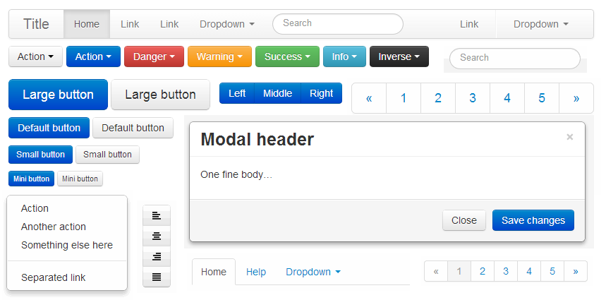
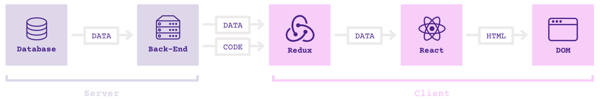

# React 技术栈

---

React 是目前最热门的前端框架。

- Facebook 公司2013年推出
- 现在最好的社区支持和生态圈
- 大量的第三方工具


---

## React 的优点

- 组件模式：代码复用和团队分工
- 虚拟 DOM：性能优势
- 移动端支持：跨终端

---

## React 的缺点

- 学习曲线较陡峭
- 全新的一套概念，与其他所有框架截然不同
- 只有采用它的整个技术栈，才能发挥最大威力

总结：React 非常先进和强大，但是学习和实现成本都不低

---

## JSX 语法

React 使用 JSX 语法，JavaScript 代码中可以写 HTML 代码。

```javascript
let myTitle = <h1>Hello, world!</h1>;
```

---

## JSX 语法解释

（1）JSX 语法的最外层，只能有一个节点。

```javascript
// 错误
let myTitle = <p>Hello</p><p>World</p>;
```

（2）JSX 语法中可以插入 JavaScript 代码，使用大括号。

```javascript
let myTitle = <p>{'Hello ' + 'World'}</p>
```

---

## Babel 转码器

JavaScript 引擎（包括浏览器和 Node）都不认识 JSX，需要首先使用 Babel 转码，然后才能运行。

```html
<script src="react.js"></script>
<script src="react-dom.js"></script>
<script src="babel.min.js"></script>
<script type="text/babel">
  // ** Our code goes here! **
</script>
```

React 需要加载两个库：React 和 React-DOM，前者是 React 的核心库，后者是 React 的 DOM 适配库。

Babel 用来在浏览器转换 JSX 语法，如果服务器已经转好了，浏览器就不需要加载这个库。

---

## 课堂练习：JSX 语法

浏览器打开`demos/jsx-demo/index.html`，按照[《操作说明》](../demos/README.md#jsx)，完成练习。

```javascript
ReactDOM.render(
  <span>Hello World!</span>,
  document.getElementById('example')
);
```

---

## 示例：React 组件

React 允许用户定义自己的组件，插入网页。

浏览器打开`demos/react-component-demo/index1.html`，按照[《操作说明》](../demos/README.md#react-组件语法)，仔细查看源码。

```javascript
class MyTitle extends React.Component {
  render() {
    return <h1>Hello World</h1>;
  }
};

ReactDOM.render(
  <MyTitle/>,
  document.getElementById('example')
);
```

---

## 课堂练习：组件的参数

组件可以从外部传入参数，内部使用`this.props`获取参数。

打开`demos/react-component-demo/index2.html`，按照[《操作说明》](../demos/README.md#react-组件的参数)，完成练习。

```javascript
class MyTitle extends React.Component {
  render() {
    return <h1
      style={{color: this.props.color}}
    >Hello World</h1>;
  }
};

<MyTitle color="red" />,
```

---

## 示例：组件的状态

组件往往会有内部状态，使用`this.state`表示。

浏览器打开`demos/react-component-demo/index3.html`，按照[《操作说明》](../demos/README.md#react-组件的状态)，仔细查看源码。


---

## 课堂练习：React 组件实战

浏览器打开`demos/react-component-demo/index4.html`，按照[《操作说明》](../demos/README.md#react-组件实战)，完成练习。

---

## 组件的生命周期

React 为组件的不同生命阶段，提供了近十个钩子方法。

- `componentWillMount()`：组件加载前调用
- `componentDidMount()`：组件加载后调用
- `componentWillUpdate()`: 组件更新前调用
- `componentDidUpdate()`: 组件更新后调用
- `componentWillUnmount()`：组件卸载前调用
- `componentWillReceiveProps()`：组件接受新的参数时调用

我们可以利用这些钩子，自动完成一些操作。

---

## 课堂练习：组件的生命周期

组件可以通过 Ajax 请求，从服务器获取数据。Ajax 请求一般在`componentDidMount`方法里面发出。

```javascript
componentDidMount() {
  const url = '...';
  $.getJSON(url)
    .done()
    .fail();
}
```

打开`demos/react-lifecycle-demo/index.html`，按照[《操作说明》](../demos/README.md#react-组件的生命周期)，完成练习。

---

## React 组件库

React 的一大优势，就是网上有很多已经写好的组件库，可以使用。

React-Bootstrap：https://react-bootstrap.github.io/



---

## 示例：ReCharts

ReCharts 是一个 React 图表组件库。http://recharts.org/

浏览器打开`demos/recharts-demo/index.html`，按照[《操作说明》](../demos/README.md#recharts)，仔细查看源码，体会 JSX 语法对表达复杂组件的优势。

```html
<LineChart width={1000} height={400} data={data}>
  <XAxis dataKey="name"/>
  <YAxis/>
  <CartesianGrid stroke="#eee" strokeDasharray="5 5"/>
  <Line type="monotone" dataKey="uv" stroke="#8884d8" />
  <Line type="monotone" dataKey="pv" stroke="#82ca9d" />
</LineChart>
```

---

## React 的核心思想

View 是 State 的输出。

```javascript
view = f(state)
```

上式中，`f`表示函数关系。只要 State 发生变化，View 也要随之变化。

---

React 的本质是将图形界面（GUI）函数化。

```javascript
const person = {
  name: "michel",
  age: 31
}

const App = ({ person }) => <h1>{ person.name }</h1>

ReactDOM.render(<App person={person} />, document.body)
```

---

## React 没有解决的问题

React 本身只是一个 DOM 的抽象层，使用组件构建虚拟 DOM。

如果开发大应用，还需要解决两个问题。

- 架构：大型应用程序应该如何组织代码？
- 通信：组件之间如何通信？

---

## 架构问题

React 只是视图层的解决方案，可以用于任何一种架构。

- MVC
- MVVM
- Observer
- Reactive
- ...

到底哪一种架构最合适 React ？

---

## 通信问题

组件会发生三种通信。

- 向子组件发消息
- 向父组件发消息
- 向其他组件发消息

React 只提供了一种通信手段：传参。对于大应用，很不方便。

---

## 状态的同步

通信的本质是状态的同步。

React 同步状态的基本方法：找到通信双方最近的共同父组件，通过它的`state`，使得子组件的状态保持同步。

---

## Flux 架构

Facebook 提出 Flux 架构的概念，被认为是 React 应用的标准架构。


最大特点：数据单向流动。与 MVVM 的数据双向绑定，形成鲜明对比。

---

## Flux 的核心思想

- 不同组件的`state`，存放在一个外部的、公共的 Store 上面。
- 组件订阅 Store 的不同部分。
- 组件发送（dispatch）动作（action），引发 Store 的更新。

Flux 只是一个概念，有30多种实现。

---

## 目前最流行的两个 React 架构

React 架构的最重要作用：管理 Store 与 View 之间的关系。

- MobX：响应式（Reactive）管理，state 是可变对象，适合中小型项目
- Redux：函数式（Functional）管理，state 是不可变对象，适合大型项目

---

## MobX 架构

MobX 的核心是观察者模式。

- Store 是被观察者（observable）
- 组件是观察者（observer）

一旦`Store`有变化，会立刻被组件观察到，从而引发重新渲染。

---

## MobX 的最简单例子

```javascript
const {observable, computed} = mobx;
const {observer} = mobxReact;

const person = observable({name: "张三", age: 31});

const App = observer(
  ({ person }) => <h1>{ person.name }</h1>
);

ReactDOM.render(<App person={person} />, document.body);
person.name = "李四";
```

代码：`demos/mobx-demo/browser-demo`目录

---

## 示例：MobX

进入`demos/mobx-demo`目录，按照[《操作说明》](../demos/README.md#mobx)，理解 MobX 框架。

---

UI 层是观察者，Store 是被观察者。

Store 所有的属性，分成两大类：直接被观察的属性和自动计算出来的属性。

```javascript
class Store {
  @observable name = 'Bartek';
  @computed get decorated() {
    return `${this.name} is awesome!`;
  }
}
```

UI 会观察到 Store 的变化，自动重新渲染。

---

## Redux 架构

Redux 的核心概念

- 所有的状态存放在`Store`。组件每次重新渲染，都必须由状态变化引起。
- 用户在 UI 上发出`action`。
- `reducer`函数接收`action`，然后根据当前的`state`，计算出新的`state`。


---

## Redux 应用的架构



Redux 层保存所有状态，React 组件拿到状态以后，渲染出 HTML 代码。

---

## 示例：Redux

进入`demos/redux-demo`目录，按照[《操作说明》](../demos/README.md#redux)，理解 Redux 框架。

---

- Redux 将组件分成 UI 组件和容器组件两类。
- UI 组件是纯组件，不包含 state 和生命周期方法，不涉及组件的行为，只涉及组件的外观。

```javascript
<div className="index">
  <p>{this.props.text}</p>
  <input
    defaultValue={this.props.name}
    onChange={this.props.onChange}
  />
</div>
```

---

容器组件正好相反。

- 不涉及组件的外观，只涉及组件的行为。
- 负责订阅 Store，将 Store 的数据处理以后，再通过参数传给 UI 组件。
- 用户给出配置以后，由 Redux 生成。

```javascript、
// MyComponent 是纯的 UI 组件
const App = connect(
  mapStateToProps,
  mapDispatchToProps
)(MyComponent);
```

- mapStateToProps: 定义 UI 组件参数与 State 之间的映射
- mapDispatchToProps：定义 UI 组件与 Action 之间的映射

---

## 拆分 UI 组件和容器组件的好处

- UI 组件与后台数据无关，可以由设计师负责
- 容器组件只负责数据和行为，一旦 Store 的数据结构变化，只要调整容器组件即可
- 表现层和功能层脱钩，有利于代码重用，也有利于看清应用的数据结构和业务逻辑

---

## Reducer 函数

`reducer`是一个纯函数，用来接收`action`，算出新的`state`。

```javascript
function reducer(state = {
  text: '你好，访问者',
  name: '访问者'
}, action) {
  switch (action.type) {
    case 'change':
      return {
        name: action.payload,
        text: '你好，' + action.payload
      };
  }
}
```

---

- `Store`由 Redux 提供的`createStore`方法生成，该方法接受`reducer`作为参数。
- 为了把`Store`传入组件，必须使用 Redux 提供的`Provider`组件在应用的最外面，包裹一层。

```javascript
const store = createStore(reducer);

ReactDOM.render(
  <Provider store={store}>
    <App />
  </Provider>,
  document.body.appendChild(document.createElement('div'))
);
```

