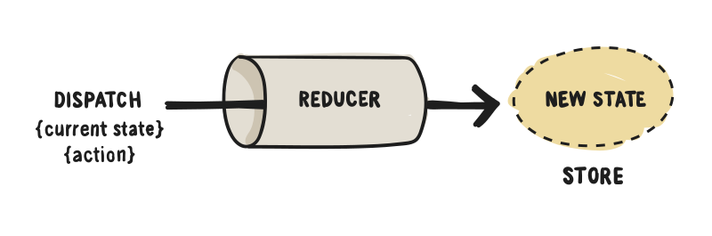

# React 技术栈

---

React 是目前最热门的前端框架。

- Facebook 公司2013年推出
- 有着现在最好的社区支持和生态圈


---

## React 的优点

- 组件模式
- 虚拟 DOM
- 移动端支持

---

## React 的缺点

- 学习曲线较陡峭
- 全新的一套概念，与其他所有框架截然不同
- 只有采用它的整个技术栈，才能发挥最大威力

React 非常先进和强大，但是学习和实现成本都不低

---

## JSX 语法

React 使用 JSX 语法，JavaScript 代码中可以写 HTML 代码。

```javascript
let myTitle = <h1>Hello, world!</h1>;
```

---

## JSX 语法解释

1. JSX 语法的最外层，只能有一个节点。

  ```javascript
  // 错误
  let myTitle = <p>Hello</p><p>World</p>;
  ```


2. JSX 语法中可以插入 JavaScript 代码，使用大括号。

  ```javascript
  let myTitle = <p>{'Hello ' + 'World'}</p>
  ```

---

## Babel 转码器

JavaScript 引擎（包括浏览器和 Node）都不认识 JSX，需要首先使用 Babel 转码，然后才能运行。

```html
<script src="react.js"></script>
<script src="react-dom.js"></script>
<script src="babel.min.js"></script>
<script type="text/babel">
  // ** Our code goes here! **
</script>
```

React 需要加载两个库：React 和 React-DOM，前者是 React 的核心库，后者是 React 的 DOM 适配库。

Babel 用来在浏览器转换 JSX 语法，如果服务器已经转好了，浏览器就不需要加载这个库。

---

## 示例：JSX 语法

浏览器打开`demos/jsx-demo/index.html`，仔细查看源码。

```javascript
ReactDOM.render(
  <span>Hello World!</span>,
  document.getElementById('example')
);
```

---

## 示例：React 组件

React 允许用户定义自己的组件，插入网页。

浏览器打开`demos/react-component-demo/index1.html`，仔细查看源码。

```javascript
  class MyTitle extends React.Component {
    render() {
      return <h1>Hello World</h1>;
    }
  };

  ReactDOM.render(
    <MyTitle/>,
    document.getElementById('example')
  );
```

---

## 示例：组件的参数

组件可以从外部传入参数，内部使用`this.props`获取参数。

打开`demos/react-component-demo/index2.html`，仔细查看源码。

```javascript
class MyTitle extends React.Component {
  render() {
    return <h1
      style={{color: this.props.color}}
    >Hello World</h1>;
  }
};

<MyTitle color="red" />,
```

---

## 示例：组件的状态

组件往往会有内部状态，通常与用户互动相关，使用`this.state`表示。

浏览器打开`demos/react-component-demo/index3.html`，仔细查看源码。


---

## 示例：React 组件实战

浏览器打开`demos/react-component-demo/index4.html`。

点击`Hello World`，看看会发生什么。

---

## 组件的生命周期

React 为组件的不同生命阶段，提供了近十个钩子方法。

- componentWillMount()：组件加载前调用
- componentDidMount()：组件加载后调用
- componentDidUpdate(): 组件更新前调用
- componentWillUnmount()：组件卸载前调用

我们可以利用这些钩子，自动完成一些操作。

---

## 示例：组件的生命周期

组件可以通过 Ajax 请求，从服务器获取数据。Ajax 请求一般在`componentDidMount`方法里面发出。

打开`demos/react-lifecycle-demo/index.html`，仔细查看源码。

```javascript
componentDidMount() {
  const url = '...';
  $.getJSON(url)
    .done()
    .fail();
}
```

---

## React 组件库

React 的一大优势，就是网上有很多已经写好的组件库，可以使用。

React-Bootstrap：https://react-bootstrap.github.io/


---

## 示例：ReCharts

ReCharts 是一个 React 图表组件库。http://recharts.org/

浏览器打开`demos/recharts-demo/index.html`，查看效果。

```html
<LineChart width={1000} height={400} data={data}>
  <XAxis dataKey="name"/>
  <YAxis/>
  <CartesianGrid stroke="#eee" strokeDasharray="5 5"/>
  <Line type="monotone" dataKey="uv" stroke="#8884d8" />
  <Line type="monotone" dataKey="pv" stroke="#82ca9d" />
</LineChart>
```

---

## React 应用的架构

React 只是一个 DOM 的抽象层，并没有解决应用程序的架构问题：大型应用程序应该如何组织代码？

Facebook 提出 Flow 架构的概念。


---

## 目前最流行的两个 React 框架

- MobX：采用观察者模式，自动响应数据变化
- Redux：Flow 的函数式实现

---

## MobX 架构

MobX 的核心概念，就是组件是观察者，一旦`Store`有变化，会立刻被组件观察到，从而引发重新渲染。

```javascript
@observer
class App extends React.Component {
  render() {
    // ...
  }
}
```

---

## 示例：MobX

进入`demos/mobx-demo`目录，按照《操作说明》，理解 MobX 框架。

---

## Redux 架构

Redux 的核心概念

- 所有的状态存放在`Store`。组件每次重新渲染，都必须由状态变化引起。
- 用户在 UI 上发出`action`。
- `reducer`函数接收`action`，然后根据当前的`state`，计算出新的`state`。



---

## 示例：Redux

进入`demos/redux-demo`目录，按照《操作说明》，理解 Redux 框架。
